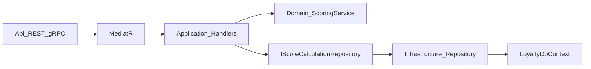

# LoyaltyHub

LoyaltyHub is a .NET microservice solution for customer loyalty score calculation.
The first service is **Loyalty**. It exposes REST and gRPC endpoints, uses Clean Architecture, Domain-Driven Design (DDD), and CQRS (MediatR).

## Technologies

- .NET 10 / ASP.NET Core
- SQL Server (EF Core Code First)
- REST (Swagger/OpenAPI)
- gRPC
- Docker / Docker Compose

## Repository layout

Teams often organize microservices in three ways:

1. One Git repository and one Visual Studio solution (all services in folders).
2. One Git repository and a separate solution per service.
3. A separate Git repository (and solution) per service.

This project uses **way 1**: one repository and one solution (`LoyaltyHub.slnx`).
Each service lives under `src/Services/{ServiceName}/` with its own API host.
Today only the Loyalty service is implemented. A new service can be added in the same solution without creating a new repository.

## Solution structure

```
src/Services/Loyalty/
  LoyaltyHub.Loyalty.Api              REST + gRPC host
  LoyaltyHub.Loyalty.Application      CQRS commands, FluentValidation, repository interfaces
  LoyaltyHub.Loyalty.Domain           Entities, enums, domain scoring service
  LoyaltyHub.Loyalty.Infrastructure   EF Core, SQL Server, migrations, repository implementations
```

## Architecture patterns

Loyalty uses Clean Architecture, Domain-Driven Design (DDD), CQRS (MediatR), and the Repository pattern together. These are separate ideas that work well in combination.

### Clean Architecture

Layer dependencies point inward. Outer layers may depend on inner layers; inner layers never depend on outer layers.

```
Api → Application, Infrastructure
Infrastructure → Application
Application → Domain
Domain → (none)
```

| Layer | Project | Responsibility |
|-------|---------|----------------|
| Domain | `LoyaltyHub.Loyalty.Domain` | Business language, entities, domain services |
| Application | `LoyaltyHub.Loyalty.Application` | Use cases (commands/queries), validation, persistence interfaces |
| Infrastructure | `LoyaltyHub.Loyalty.Infrastructure` | EF Core, SQL Server, repository implementations |
| Api | `LoyaltyHub.Loyalty.Api` | REST controllers, gRPC services, host configuration |

### Domain-Driven Design (DDD)

DDD is how the business is modeled in code. It is not a special C# syntax. In this service, look under `LoyaltyHub.Loyalty.Domain`:

| Location | Role |
|----------|------|
| [`Entities/ScoreCalculation.cs`](src/Services/Loyalty/LoyaltyHub.Loyalty.Domain/Entities/ScoreCalculation.cs) | Aggregate/entity: private setters, private constructor, `Create` factory |
| [`Entities/RecentPurchase.cs`](src/Services/Loyalty/LoyaltyHub.Loyalty.Domain/Entities/RecentPurchase.cs) | Child entity linked to a score calculation |
| [`Services/LoyaltyScoringService.cs`](src/Services/Loyalty/LoyaltyHub.Loyalty.Domain/Services/LoyaltyScoringService.cs) | Domain service: scoring formulas and bonus rules |
| [`Enums/CustomerType.cs`](src/Services/Loyalty/LoyaltyHub.Loyalty.Domain/Enums/CustomerType.cs) | Domain vocabulary |

Scoring rules stay in `LoyaltyScoringService`. Controllers and gRPC services must not contain scoring formulas.

### CQRS (MediatR)

Commands and queries are separate request types under `LoyaltyHub.Loyalty.Application/Features/...`. Controllers and gRPC services call MediatR (`ISender`) only; they never inject handlers directly. Handlers orchestrate the domain service and persistence interfaces.

### Repository pattern

Application defines persistence contracts. Infrastructure implements them with EF Core. Handlers depend on the interface, not on the concrete `DbContext`.

| Contract (Application) | Implementation (Infrastructure) |
|------------------------|----------------------------------|
| [`IScoreCalculationRepository`](src/Services/Loyalty/LoyaltyHub.Loyalty.Application/Interfaces/IScoreCalculationRepository.cs) | [`ScoreCalculationRepository`](src/Services/Loyalty/LoyaltyHub.Loyalty.Infrastructure/Persistence/Repositories/ScoreCalculationRepository.cs) |

`LoyaltyDbContext` stays in Infrastructure. CQRS does not require exposing `DbContext` to Application. Keeping EF in Infrastructure leaves Application free of EF packages and preserves the Clean Architecture boundary.



## Prerequisites

- .NET 10 SDK
- SQL Server (LocalDB, Express, Developer, or Docker)
- Optional: Docker Desktop

## Configuration and environments

`AppSettings` (JSON section) binds to the `AppSettings` record in Application (`Models/AppSettings.cs`). When you add or change properties under `AppSettings`, update this section.

| Environment | Typical use                         | Version | Environment (AppSettings) | IsSwaggerActivated | IsSeedDataActivated | IsGrpcReflectionActivated |
|-------------|-------------------------------------|---------|---------------------------|--------------------|---------------------|---------------------------|
| Development | Local machine (`localhost`)         | D       | Development               | true               | true                | true                      |
| Staging     | Docker Compose / shared test server | S       | Staging                   | true               | false               | true                      |
| Production  | Deployed server                     | P       | Production                | false              | false               | false                     |

Set the ASP.NET Core environment with `ASPNETCORE_ENVIRONMENT`. Production values come from base `appsettings.json`.

### Secrets / env examples

- **Development:** use `appsettings.Development.json` (no Docker env file required).
- **Staging / Production:** real secrets live in gitignored env files. Copy the committed samples, then fill real values:

```bash
cp deploy/.env.staging.example deploy/.env.staging
cp deploy/.env.production.example deploy/.env.production
```

- Do not commit `deploy/.env.staging` or `deploy/.env.production`.
- ASP.NET Core binds nested keys with `__` (for example `ConnectionStrings__LoyaltyDb`, `AppSettings__IsSwaggerActivated`).
- Default `AppSettings` flags per environment are in the table above.
- Details: [`deploy/SECRETS_AND_ENV.md`](deploy/SECRETS_AND_ENV.md).

Connection string key: `ConnectionStrings:LoyaltyDb`

Development default (Windows Integrated Security):

```
Server=localhost;Database=LoyaltyHub_Loyalty_Dev;Trusted_Connection=True;TrustServerCertificate=True;MultipleActiveResultSets=true
```

Do not commit real passwords. Replace `CHANGE_ME` placeholders before Staging/Production use.
Override secrets with environment variables, for example:

```
ConnectionStrings__LoyaltyDb=Server=...;Database=...;User Id=...;Password=...;TrustServerCertificate=True
```

## Database

- EF Core migrations live under `src/Services/Loyalty/LoyaltyHub.Loyalty.Infrastructure/Persistence/Migrations`.
- On startup the API creates the database if it is missing and applies migrations automatically.
- You do **not** need to run `Update-Database` in Package Manager Console for a normal run.
- Tables:
  - `ScoreCalculations` — one row per score calculation (amount, customer type, bonuses, final score).
  - `RecentPurchases` — one row per purchase amount linked to a calculation (`ScoreCalculationId` FK, cascade delete). Unique `(ScoreCalculationId, Sequence)` preserves input order.
  - `DbSeedVersions` — tracks applied data-seed versions (unique `Version`).
- `AppSettings` (JSON section) binds to the `AppSettings` record in Application (`Models/AppSettings.cs`) via DI (`Configure` + singleton). Do not read flags with `GetValue("AppSettings:...")`.
- Sample seed (SSMS / local inspection):
  - Controlled by `AppSettings.IsSeedDataActivated` (`true` in Development; `false` in base and Staging).
  - When activated and seed version V1 is not recorded yet, startup inserts five sample calculations with related `RecentPurchases`, then records `DbSeedVersions` V1.
  - Seeding is skipped when the flag is off or when V1 is already applied (even if calculation rows were deleted).
  - Root `docker-compose.yml` (local Staging demo) and deploy Staging compose set the full Staging `AppSettings` env overrides. See the Configuration and environments table and `deploy/SECRETS_AND_ENV.md`.

### Add a new migration (Package Manager Console)

In Visual Studio **Package Manager Console**:

1. Set **Default project** to `LoyaltyHub.Loyalty.Infrastructure`.
2. Run:

```powershell
Add-Migration YourMigrationName -StartupProject LoyaltyHub.Loyalty.Api -OutputDir Persistence/Migrations
```

- Startup project must be `LoyaltyHub.Loyalty.Api` so design-time configuration resolves.
- Output directory is `Persistence/Migrations` under Infrastructure.
- You normally do **not** need `Update-Database`; the API applies migrations on startup.

Equivalent CLI (from the repository root):

```bash
dotnet ef migrations add YourMigrationName \
  --project src/Services/Loyalty/LoyaltyHub.Loyalty.Infrastructure/LoyaltyHub.Loyalty.Infrastructure.csproj \
  --startup-project src/Services/Loyalty/LoyaltyHub.Loyalty.Api/LoyaltyHub.Loyalty.Api.csproj \
  --output-dir Persistence/Migrations
```

## Run locally

1. Update `src/Services/Loyalty/LoyaltyHub.Loyalty.Api/appsettings.Development.json` if your SQL Server name differs.
2. From the repository root:

```bash
dotnet restore LoyaltyHub.slnx
dotnet run --project src/Services/Loyalty/LoyaltyHub.Loyalty.Api/LoyaltyHub.Loyalty.Api.csproj
```

3. Open Swagger:
   - HTTP: `http://localhost:5080/swagger/index.html`
   - HTTPS: `https://localhost:7080/swagger/index.html` (Visual Studio / `https` launch profile)

## Before Staging / Production

The following are **not implemented** for Web API or gRPC. Implement them before publishing to Staging or Production:

- **CORS** — allow only trusted browser origins.
- **Health checks** — readiness/liveness endpoints and Docker/orchestration probes.
- **Rate limiting / Too Many Requests (429)** — protect REST and gRPC from abuse.
- **Other security** — authentication/authorization, TLS (including gRPC), keep Swagger and gRPC reflection off in Production (`AppSettings` flags), and manage secrets as in [`deploy/SECRETS_AND_ENV.md`](deploy/SECRETS_AND_ENV.md).

## Run with Docker

Each microservice has its own Dockerfile (Loyalty: `src/Services/Loyalty/Dockerfile`). Root Compose orchestrates services and SQL Server.

### Local Staging demo

From the repository root:

```bash
docker compose up --build
```

- API: `http://localhost:8080`
- Swagger (Staging): `http://localhost:8080/swagger/index.html`
- gRPC: `localhost:8081`
- SQL Server: `localhost:1433` (sa password is set in `docker-compose.yml` for local demo only)

### Staging / Production (deploy)

Copy env examples, fill secrets, then start (never commit the real env files):

```bash
cp deploy/.env.staging.example deploy/.env.staging
docker compose -f deploy/docker-compose.staging.yml --env-file deploy/.env.staging up -d --build

cp deploy/.env.production.example deploy/.env.production
docker compose -f deploy/docker-compose.production.yml --env-file deploy/.env.production up -d --build
```

| Stack | REST | gRPC | SQL |
|-------|------|------|-----|
| Staging deploy | `http://localhost:8080` | `localhost:8081` | `localhost:1433` |
| Production deploy | `http://localhost:9080` | `localhost:9081` | `localhost:1434` |

See [`deploy/SECRETS_AND_ENV.md`](deploy/SECRETS_AND_ENV.md).

## REST API

### Calculate score

`POST /api/loyalty/score`

Example body:

```json
{
  "purchaseAmount": 20000001,
  "customerType": 3,
  "recentPurchases": [4000000, 4000000, 4000000, 4000000, 4000001]
}
```

`customerType` values: `1` = Bronze, `2` = Silver, `3` = Gold.

### Get score calculation by id

`GET /api/loyalty/score-calculations/{id}?includeRecentPurchases=true`

- `includeRecentPurchases` defaults to `true`. When `true`, the response includes `recentPurchases` ordered by sequence.
- Returns `404` when the id does not exist. A well-formed Guid that is not in the database still returns this response (resource missing).

Example `404` response (ASP.NET Core Problem Details):

```json
{
  "type": "https://tools.ietf.org/html/rfc9110#section-15.5.5",
  "title": "Not Found",
  "status": 404,
  "traceId": "00-509b75c564b2a1e4c87e0d8f5075a81e-740c39f462da814b-00"
}
```

- `type`: URI that identifies the problem. For HTTP 404 it points at RFC 9110 section 15.5.5 (Not Found).
- `title` / `status`: short summary and HTTP status code.
- `traceId`: request correlation id (W3C Trace Context style) for matching server logs. It is not an application error code and is unrelated to the path Guid.

Example response (with purchases):

```json
{
  "calculationId": "3fa85f64-5717-4562-b3fc-2c963f66afa6",
  "purchaseAmount": 20000001,
  "customerType": 3,
  "purchaseCount": 5,
  "baseScore": 333333.35,
  "frequencyBonus": 0.1,
  "highPurchaseBonus": 0.075,
  "totalBonus": 0.175,
  "finalScore": 391666.68625,
  "createdAtUtc": "2026-09-04T12:00:00.0000000Z",
  "recentPurchases": [4000000, 4000000, 4000000, 4000000, 4000001]
}
```

### Get score calculations (paged)

`GET /api/loyalty/score-calculations?pageNumber=1&pageSize=25&includeRecentPurchases=false`

- `pageNumber` defaults to `1`
- `pageSize` defaults to `25` (allowed range: `1`–`100`)
- `includeRecentPurchases` defaults to `false`
- Results are ordered by `createdAtUtc` descending

Example response:

```json
{
  "items": [
    {
      "calculationId": "3fa85f64-5717-4562-b3fc-2c963f66afa6",
      "purchaseAmount": 20000001,
      "customerType": 3,
      "purchaseCount": 5,
      "baseScore": 333333.35,
      "frequencyBonus": 0.1,
      "highPurchaseBonus": 0.075,
      "totalBonus": 0.175,
      "finalScore": 391666.68625,
      "createdAtUtc": "2026-09-04T12:00:00.0000000Z",
      "recentPurchases": null
    }
  ],
  "totalCount": 1,
  "pageNumber": 1,
  "pageSize": 25
}
```

After the API is running, open Swagger UI to try these endpoints:

- Local (HTTP): `http://localhost:5080/swagger/index.html`
- Local (HTTPS launch profile): `https://localhost:7080/swagger/index.html`
- Docker (Staging demo): `http://localhost:8080/swagger/index.html`

## gRPC API

- Proto file: `src/Services/Loyalty/LoyaltyHub.Loyalty.Api/Protos/loyalty.proto`
- Service: `loyalty.LoyaltyScore`
- Methods:
  - `CalculateScore`
  - `GetScoreCalculationById` — optional `include_recent_purchases` defaults to `true` when unset; returns `NotFound` when missing
  - `GetScoreCalculationsPaged` — `page_number` / `page_size` of `0` or unset become `1` / `25`; optional `include_recent_purchases` defaults to `false` when unset; `page_size` max is `100`
- gRPC reflection is controlled by `AppSettings.IsGrpcReflectionActivated` (`true` in Development and Staging appsettings), resolved from the typed `AppSettings` record

**Local (HTTPS recommended for gRPC + REST on one port):**

Use the `https` launch profile (`https://localhost:7080`). HTTP/2 works over TLS.

**Docker:**

- REST / Swagger: `http://localhost:8080/swagger/index.html`
- gRPC (HTTP/2 cleartext): `http://localhost:8081`

You can call the methods with any gRPC client, using the proto file above.

## Scoring rules

Domain service: `LoyaltyScoringService`

1. Base score by customer type:
   - Bronze: `PurchaseAmount / 100`
   - Silver: `PurchaseAmount / 80`
   - Gold: `PurchaseAmount / 60`
2. Frequency bonus: if purchase count >= 5, add `10%` (`0.10`)
3. High-purchase bonus (on total `PurchaseAmount` only):
   - If amount is greater than `10,000,000`, add `5%`
   - For each extra full `10,000,000`, add `2.5%`
4. `FinalScore = BaseScore × (1 + TotalBonus)`

Validation: `PurchaseAmount` must equal the sum of `recentPurchases`.

High-purchase examples:

| PurchaseAmount | High-purchase bonus |
|----------------|---------------------|
| 9,999,999      | 0%                  |
| 10,000,000     | 0%                  |
| 10,000,001     | 5%                  |
| 20,000,001     | 7.5%                |
| 30,000,001     | 10%                 |

## Contributions

Your contributions and insights are highly valued.
Please explore the project, and feel free to share feedback or suggestions.

